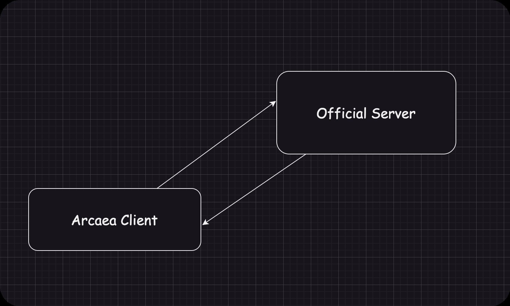
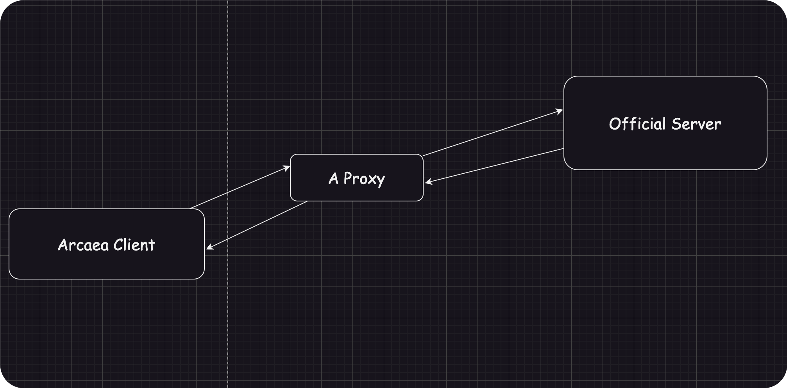
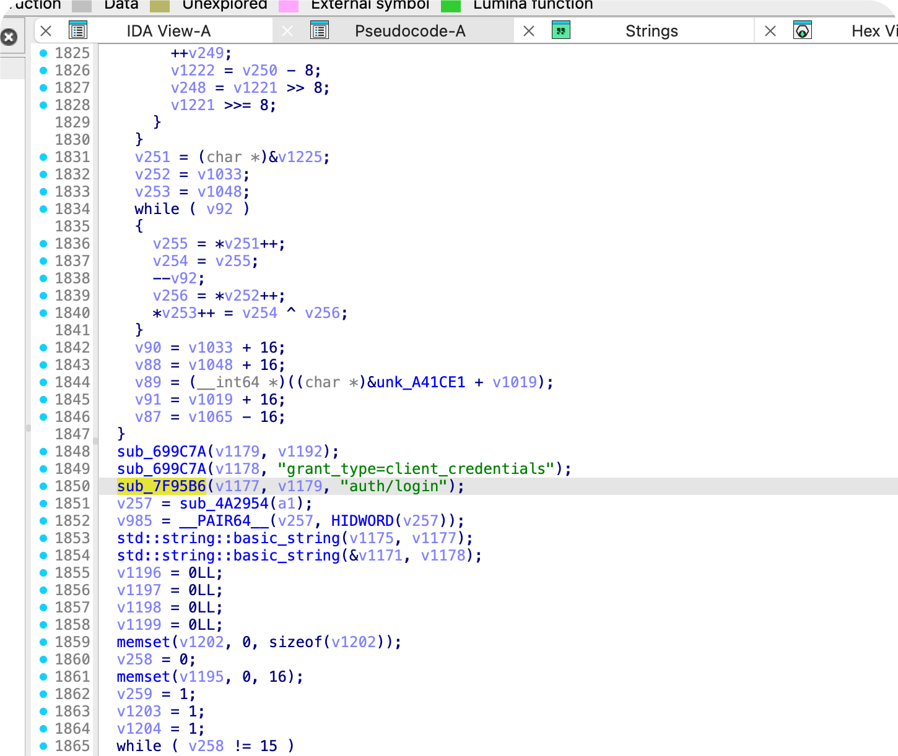

<div id="original-content" style="display: none;">
<!-- 这里是你原本要隐藏的内容 -->
</div>

<div id="mask-layer">
  <div class="unlock-container">
    <h3>🔐 技术型隐藏页面 · 验证密钥</h3>
    <div class="input-group">
      <input type="password" id="passwordInput" placeholder="输入验证密钥" autocomplete="off">
      <button onclick="checkPassword()">解锁内容</button>
    </div>
    <p id="errorMsg" style="color: #dc3545; display: none;">验证未通过，请重试</p>
  </div>
</div>

<style>
#mask-layer {
  position: fixed;
  top: 0;
  left: 0;
  width: 100%;
  height: 100%;
  background: rgba(100, 100, 100, 0.85); /* 改为灰色背景 */
  backdrop-filter: blur(8px);
  z-index: 9999;
  display: flex;
  justify-content: center;
  align-items: center;
}


.unlock-container {
  background: rgba(100, 120, 120, 0.85);
  padding: 2rem 3rem;
  border-radius: 12px;
  box-shadow: 0 4px 6px rgba(0, 0, 0, 0.1);
  color: rgba(100, 60, 80, 0.85);
  text-align: center;
  transition: transform 0.3s;
  border: 1px solid rgba(0, 0, 0, 0.1);
}

.input-group {
  margin: 1.5rem 0;
  display: flex;
  flex-direction: column;
  gap: 1rem;
}

input {
  padding: 0.8rem 1.2rem;
  border: 1px solid #ced4da;
  border-radius: 6px;
  background: rgba(255, 255, 255, 0.95);
  font-size: 1rem;
  transition: border-color 0.3s;
}

input:focus {
  outline: none;
  border-color: #6c757d;
}

button {
  padding: 0.8rem 2rem;
  background: #6c757d;
  border: none;
  border-radius: 6px;
  color: white;
  cursor: pointer;
  font-weight: 500;
  transition: all 0.3s;
}

button:hover {
  background: #5a6268;
  transform: translateY(-1px);
}

#errorMsg {
  margin-top: 1rem;
  font-size: 0.9em;
}
</style>

<script>
// 恭喜你找到密码～
// congratulations to you!
function checkPassword() {
  const input = document.getElementById('passwordInput');
  const errorMsg = document.getElementById('errorMsg');

  if (input.value === "YinMo19") {
    document.getElementById('mask-layer').style.display = 'none';
    document.getElementById('original-content').style.display = 'block';
  } else {
    errorMsg.style.display = 'block';
    input.value = '';
    setTimeout(() => errorMsg.style.display = 'none', 1500);
  }
}

// 回车键支持
document.getElementById('passwordInput').addEventListener('keypress', (e) => {
  if (e.key === 'Enter') checkPassword();
});
</script>

> 不管任何方式，总之你现在已经绕过了前面那个只是做个样子的校验，所以恭喜你可以开始阅读这篇 blog！下面将会有不少二进制逆向工程相关内容，你可能需要会一些基础的 arm asm 和一些逆向的经验才能理解。

这篇文章是关于逆向某游戏的，所以先来点...
> 本文所写内容仅供学习交流，作者对于读者所做的任何行为概不负责，如果跟着本文所写内容操作，您需要对自己的行为导致的任何后果负责！

Ok. 总所周知，某3d立体节奏游戏作为一个在线游戏（虽然只有登陆上传下载还有 LINK 的时候需要用到网络），那么必然存在一个服务器。而且在游戏本体中必然直接硬编码了一个游戏地址，否则游戏的数据就无法对着服务器发送。

在早期版本并没有对这个服务器地址进行什么操作，直接使用明文写在二进制中。但是在3.6.0左右进行了一次比较大的改动，对地址进行了加密。在4.5.0左右版本又对加密算法进行了一些小更新。因此本文主要关于逆向这个加密算法。

之所以逆向这个服务器地址，当然是因为我们想要搭建一个自己的私服。所以在讲述这个过程之前先让我首先对 [Lost-MSth](https://github.com/Lost-MSth)大佬表示最深刻的敬意，是他手把手教我如何操作，并且给我很多支持（在这个过程中我犯的傻不计其数）。我的私服程序来源于他发布在 Github 上的 [Arcaea-Server](https://github.com/Lost-MSth/Arcaea-Server)。

本文参考了

- [Arcaea-Server](https://github.com/Lost-MSth/Arcaea-Server)
- [看雪论坛：[原创] 某 iOS 遊戲抓包、修改](https://bbs.kanxue.com/thread-273849.htm)
- [fishiat 的 blog](https://fishiat.github.io/arcmodwiki/private-server.html)
- [Android 无 ROOT 权限动态调试 (By Lost)](https://blog.lost-msth.cn/2023/02/01/android-debug-without-root.html)

什么是私服，怎么搭建
---
这个其实完全不应该由我来说，在 [Arcaea-Server](https://github.com/Lost-MSth/Arcaea-Server) 中已经有良好的文档，请一个字一个字阅读。这个仓库的 Wiki 可以说微言大义，错过了任何内容都是损失。

但是我们想讲讲关于私服本身。下面是一张简单的结构图

这张图简单的展示了其的网络结构。客户端通过网络和官方服务器通信。这种通信基于 https,并且这游戏还做了双端证书校验（一般的https服务仅仅校验服务器证书）防止被抓包。中间的技术细节就不展开。我们的目标是搭建一个自己的服务器，而让一个修改后的私服客户端和我们的服务器通信。可以想到的第一种方法是

我们首先通过代理服务器来作为中间链接，然后让代理服务器劫持所有指向官方服务器的流量，然后将其转发，或者说重定向到你自己的服务器。

但是这种方法相当于每个人想要玩到你的服务器都需要这样做，不提这样做的实现是否真的可行，这样对于玩家显然一点也不友好。

那有没有什么做法干净又卫生呢？
---
那我们回到最开始的路径。

我们在开头提到过，既然要访问到官方服务器，那么一定在客户端写死了服务器的地址。那么有没有可能我们可以直接更改客户端来让客户端直接访问我们的服务器呢？

这就是本文的目的了。

关于修改地址
---
首先我们要先来确定加密的方式和加密的位置。由于更高版本的客户端二进制中加入了更多的混淆，因此我们选一个比较好逆向的客户端。我选取的是4.5.x版本的一个客户端。

> 当然你选什么都一样，只是后面的版本inline function 太狠了，一个函数长达两万行你的电脑可能需要分析得很久，反正算法没改选一个早期没混淆那么多的分析起来快点。
>
> 下面当然是基于4.5.x版本的一个客户端的案例，我讲讲如果你选取别的客户端要怎么分析。 如果你 decompile 的时候发现因为太长无法反编译，那么你可以在ida 的 edit-plugins-hex ray decompiler options中找到 analyse option 3，把第一个改到 1024 第二个改到 256，然后重新反编译就可以了。
>
> 6.x 版本api 有了一个 break change!
>
> auth 部分独立开了。 以往的 api 完全在 `https://arcapi-v3.lowiro.com/<endpoint>` 内，目前 auth 部分单独走 `https://auth.lowiro.com/` 。但是加密手段完全一致，你依然可以根据下文的手段进行分析，只是 48bytes 变成了 36bytes 罢了。

继续对低版本的分析，首先我们通过 `apktool` 来将其拆开。我们需要更改的是其下的 `lib/armeabi-v7a/libcocos2dcpp.so` 文件。我们选取32位，它的逆向更简单，而且动态调试也更加简单。不要忘记删除 `lib/arm64-v8a/` 文件夹。否则手机会自动使用64位版本的二进制文件。

> 我的所有思路参考[看雪论坛：[原创] 某 iOS 遊戲抓包、修改](https://bbs.kanxue.com/thread-273849.htm)，当然这篇文章中的地址已经不适用了，因为这篇文章是给4.2.x 使用的，上文提到4.5.x修改了加密密钥。

使用 ida pro 打开这个文件。IDA PRO 是一款优秀的反汇编工具，这里就不赘述了。

选择默认选项（ida已经帮我们识别它的类型了（linux elf 二进制动态链接库文件），打开之后 ida 会自动解析这个二进制文件，解析速度取决于文件大小，不过我们可以先进行操作，操作的时候解析过程会先停止优先保证我们的操作流畅度。我们可以先搜索字符串（快捷键 shift-F12） `auth/login`。之所以搜索这个，是因为登陆必须对服务器进行请求，一定会涉及到服务器地址，这毋庸置疑。

搜索到这个字符串之后我们可以按 X 键查看引用，直接跳转到第一个引用的地方。

跳转到的地方可能会出现一些框图，这是代码的结构图，主要是程序的结构。可以按空格退回汇编界面。接下来按 F5 可以查看函数的反编译的伪c代码。

我们可以读代码，并按n对变量名称进行修改。（在编译过程中编译器会对变量名重命名，因此我们变量名信息丢失之后 ida 只能使用 v1v2 这样的变量来表示。如果我们阅读之后可以确定含义我们可以对其重命名来明晰代码）

根据分析我们大概可以确定（其实是根据前人的经验）代码结构如下

其中 `idx` 可以查看引用看看赋值位置

而又有

显然 idx 最开始是16，然后大循环之后赋值给v1073，然后v1073没经过任何修改又给idx赋值。在后面的 while 循环中作为递减变量控制循环刚好进行16次。阅读代码，会发现上面有一串非常长的代码，几乎毫无可阅读性。

从大佬的文章大概可以知道这是一种 CFB 加密，也就是上一次加密的结果再通过某种算法获得下一次加密的密钥。而根据 idx 我们大概知道一次加密16个字节，根据实际的地址长短
```txt
https://arcapi-v3.lowiro.com/<api_endpoint>
```
是分成三次加密。而不到48字节则在最后补`\0x00`。因此我们不能拿到算法本身，我们就只能通过动态调试，通过修改内存值，再拿到每一次的XOR KEY来获取结果。

总结一下，大概算法是这样的：
```python
def get_next_xor_key(last_addr: bytes, last_xor_key):
    # do something weird
    # calculate next xor key
    return next_xor_key


for i in range(3):
    addr = "aosiaosciaqwu12hoichoaichoaihcoccqwocihqoqwdwqwd"[16 * i : 16 * (i + 1)]
    for j in range(16):
        next_addr = next_xor_key[j] ^ addr[j]

    next_xor_key = get_next_xor_key(next_addr, next_xor_key)
```
现在我们有 `a^b = c, c^b = a^b^b = a` ，所以我们可以通过直接通过拿到内存中的 xor_key 和我们想要的地址直接计算出加密之后的地址。而加密的地址和密钥再 XOR 之后即可获取到解密的结果。算法具体请参照[看雪论坛：[原创] 某 iOS 遊戲抓包、修改](https://bbs.kanxue.com/thread-273849.htm)。

动态调试
---
在现在 root 手机变得相对更加困难，更取决于手机厂商是否让root，而非是自己的技术。但是这游戏并没有关于反 debug 的校验，所以我们只需要通过修改安装包，然后直接通过 `run-as` 命令来控制 debug 就可以实现无 root 权限调试。

关于这一块的内容请阅读[Android 无 ROOT 权限动态调试 (By Lost)](https://blog.lost-msth.cn/2023/02/01/android-debug-without-root.html) 这里补充说明一下，在 ida 9.0 mac版本上的 `android_server` 无后缀是 64位的，有32后缀的是32位的，和教程中的不一样，需要注意。

我们将更改好的软件传输到手机上安装云云.... (推荐直接使用 `adb push xxx.apk /storage/emulated/0/` 应该至少有30-40mb/s 速度) 然后将端口转发设置好，并启动ida的服务器。

这里我没有演示如何传入服务器文件和chmod改777权限部分，还是请参照 Lost-MSth大佬的blog [Android 无 ROOT 权限动态调试 (By Lost)](https://blog.lost-msth.cn/2023/02/01/android-debug-without-root.html)。


现在我们应该在哪里下断点呢？显然是

在while循环之前，while循环进行 xor 加密，在此之前刚好拿到上一次加密结束的密钥，我们可以直接对着我们想要的结果和密钥 xor 之后写入对应的内存，然后下一次加密就会使用这个新的地址计算下一次的 xor key。

显然这里第一次计算的xor key是固定的 `25 42 38 06 4B 6E 4B 3B  63 85 43 CD E6 DF BB 6F` （至少到5.10.6还是）。因此我们写一个小程序用于计算加密结果。

```python
# 你的地址 http(s)://ip:port(domain:port)/<api_endpoint>
api_prefix = "https://test.yinmo19.top/natsugakuru/30/"
if len(api_prefix) < 48:
    api_prefix += "\x00" * (48 - len(api_prefix))

b = bytes.fromhex("25 42 38 06 4B 6E 4B 3B  63 85 43 CD E6 DF BB 6F")
prefix = api_prefix[:16]
prefix = bytes.fromhex(prefix.encode().hex())
print(bytes(i ^ j for i, j in zip(prefix, b[:16])).hex(" "))

b = bytes.fromhex("25 42 38 06 4B 6E 4B 3B  63 85 43 CD E6 DF BB 6F") # 获取到第二个 xor_key 之后填入
prefix = api_prefix[16:32]
prefix = bytes.fromhex(prefix.encode().hex())
print(bytes(i ^ j for i, j in zip(prefix, b[:16])).hex(" "))

b = bytes.fromhex("25 42 38 06 4B 6E 4B 3B  63 85 43 CD E6 DF BB 6F") # 获取到第三个 xor_key 之后填入
prefix = api_prefix[32:]
prefix = bytes.fromhex(prefix.encode().hex())
print(bytes(i ^ j for i, j in zip(prefix, b[:16])).hex(" "))
```
现在进 debugger 设置一下

我们就可以选择附加进程 (Attach to Process) ，手机上启动程序，在 ida 中附加进程的可选项应该可以看到一个`[32] 包名`的选项

接下来应该会刷入一堆东西，接下来如果需要选择，就选 same。这个问题是问你在电脑上调试的内容和手机软件里面的是否一样，自然一样。然后点击上方的运行按钮，现在卡住的软件应该动起来了。随便在手机上Login输入点东西，然后按一下 Login，这个时候应该会卡住，而ida跳到刚才打的断点的位置。

现在我们双击`encrypt_addr_this`跳转到

看到 `4d 36 4c 76...(M6Lv...)` 就说明这个确实是地址（这个是地址的开头，对应 http 的加密结果）。右键选择关联到(synchronize with) hex，

这样下面的hex也对应关联到对应位置。我们直接选择菜单栏中的

改bytes，刚好一次可以改16个。我们将我们已经知道的第一个16比特直接写入。

看到橙色的修改即表示修改成功。（可以按一下 xor_key 看看是否和上文说的第一个 xor_key 一致）然后按运行个运行到下一个断点位置（还是同一个位置）。

接下来应该先看xor_key_addr ，双击查看内存地址和值

刚好是B8开头的这一行 `B8 97 5E AD FC B7 F0 EF  F1 A0 1E 5A 36 4D C1 AA` 。我们直接将整行复制下来，粘贴到上面的python脚本中的第二个位置，运行可以得到加密地址的中间16字节 `d5 f8 6f 94 d2 c3 9f 9f de ce 7f 2e 45 38 a6 cb`，和上面操作一致，写入地址。接下来就可以重复第三次操作，拿到最后一次的 xor_key，加密地址。最后将三次获取的内容拼接起来，一共48字节。以后想要开私服只需要替换掉二进制文件中的对应地址就可以了。

这里我提供一个替换小程序，如果有需要可以改改用。
```python
import os


def generate_patched_so(
    filename, before: bytes, to_replace: bytes, suffix: str = "arcapi"
):
    if not os.path.exists(filename):
        print(f"Didn't find {filename}, skipping patch generation")
        return

    with open(filename, "rb") as f:
        data = f.read()

        if data.find(to_replace) != -1:
            print(f"{filename} looks to be already patched :)")
            return

        if data.find(before) == -1:
            print(f"{filename} doesn't contain the original modulus.")
            return

        data = data.replace(before, to_replace)

        patched_filename = f"{filename}.{suffix}"
        with open(patched_filename, "wb") as f:
            f.write(data)

        print(
            f"Generated address patch to {patched_filename}! To apply the patch, replace the original file with the patched file."
        )


origin = bytes.fromhex(
    "4d364c763854641402f720ac96b696198bb932c28bde8280cad46122473cf0c63c63f8359caab6e6a6d2d4eab1db7d93"
)
replace_addr = bytes.fromhex(
    "owoqowoqciwqociowqhoiqicoiqocuwqcoqioucoqcoqwfhiqohfcowqcjwbfuiocqwhfbwusofihqwqwoifhqohwoqhqhfq"
) # 替换成你的内容

generate_patched_so("libcocos2dcpp.so", origin, replace_addr)
```
如果找到了对应部分则会在本地目录下生成一份补丁文件`libcocos2dcpp.so.arcapi`，将这个文件直接覆盖原文件即可。
```
cp libcocos2dcpp.so.arcapi libcocos2dcpp.so
```

那么就完成了。

Appendix 1
---
c 版的逆向几乎就是上面这样了，接下来是一些最新版本相关的。由于目前地址已经分为 auth.lowiro.com 和 arcapi-v3.lowiro.com，因此两个地方需要寻找。选择下断点的地方，使用登录以外还可以考虑 `/bundle_download/` api 的前面，因为这个是最初访问的 api，他会寻找适用于该版本的热更新包（国际服）。

两个地方的加密算法一致，这上问题提到了，下面是一些最新版本你可能出现的问题。

高版本的 arm 架构的 `while offset in 16{ xor }` 行为可能会被编译期自动向量化为一条 neon 指令，每 16 bytes作为一个 `int128` 直接进行 `veorq_s8`，也有可能分为两个 u64 分别 xor，这两种优化方式连带上面提到的`while offset in 16{ xor }`均在各个版本中出现过，例如 ios 版本逆向发现了 `veorq_s8`，而安卓版本则看到了仅对于 u64 的 neon。遇到这种情况下断点直接下在这条 neon 指令前面就可以了，本质上就是整个循环一条做完了没什么好说的。

但是有一点需要注意了。由于编译器优化，你会发现有时候你自定义的 api 长度过长会产生奇怪行为——例如最后几位解密失效了。这里并不是因为算法错误，而是因为 **loriwo 的 api 就那么长，所以编译器为了少算点自动在最后一次循环的计数器直接设置为特定大小**。比如按照刚才所说的

```python
for i in range(3):
    addr = "aosiaosciaqwu12hoichoaichoaihcoccqwocihqoqwdwqwd"[16 * i : 16 * (i + 1)]
    # 这里，实际上在 i = 2 的时候，j 并不会是 0 到 15，而是 0 到 一个数字（取决于原有的 api 长度）
    for j in range(16):
        next_addr = next_xor_key[j] ^ addr[j]

    next_xor_key = get_next_xor_key(next_addr, next_xor_key)
```
因此解决办法最简单的就是你别设置一个那么长的 api。

那你要是说我不，行也不行——如果你对一个 auth 的 api 想犟一下还真能做到。我们说过这只是最后一轮计数器的事情，所以稍微懂点汇编，找到计数器的特殊位置

这里的这个计数器是安卓版本的，只对 u64 进行 xor 的 neon 指令，计数器是从 -0x10开始，一次+8，到 0 结束——实际上就是一轮只算两次，刚好 16 位分成两个 u64 来算（注意 u64 实际上是 8 个 char，因为一个 char 是两个 hex，8 bytes）。请注意计数器的初始化并不是直接赋值为-0x10 而是通过一个变量，我们也懒得分析这个变量哪里来的，

直接将其置为-0x10 就可以了。汇编层面的补丁用任何方法都可以，包括去 compiler explorer 找到这条指令对应的二进制值然后编辑 hex，又或者使用高级工具例如 keypatch，这里只是最简单的赋值语句，没什么好多说的。

为什么我说只有 auth 的地方可以犟一下，因为 auth 这里只用了一次，剩下的 api 用到的位置每个地方都得改，你肯定没这个精力了（也找不全），所以我还是建议你把 api 设短点。

按 ios 的一次 16 位 veorq_s8 还需要这样操作吗？不需要了！因为一次就 16 位，根本没有计数器。

Appendix 2
---
还有。如果我没有 ida 我还能做么？~没有 ida 做个锤子破解（bushi）~ 当然可以，我假定你现在有 mac 了，因为接下来分析的是 ios 的 binary。

总所周知，因为 mac 最近用的 m 系列芯片也是 arm 架构的，所以你可以无缝的直接运行 ios 的软件，既不用跨架构也不用转译，最大的优点就是你下载了一个砸过壳的 ipa，然后cd 到目录进去之后直接./binary 就能启动。这也意味着你可以直接使用 lldb 附加到这个 binary 进行动态调试——所以现在你只需要一个能分析二进制的工具（开源的也有不少，例如ghidra），以及lldb 就可以完成调试和分析功能。下断点之类的指令请自行学习，所有逻辑都是一样的，唯一不同的是这会你只能在汇编层面下断点了，没有伪代码可以看了。

改 memory 也简单不少，你可以直接找到 offset 之后
```
memory write <address> hex hex hex hex ....
```
似乎还有机会可以做自动化处理。


后记
---
这个逆向过程其实并不难，但是确实是我接触逆向以来的一个比较大的步子。记得那天找了一个旧版的apk，真正逆向出来的时候在深夜，当时逆向出来的时候激动的跳起来，现在想起来真有意思......最后感谢前辈们提供的支持，还有 ida pro，这真的是个好软件。
