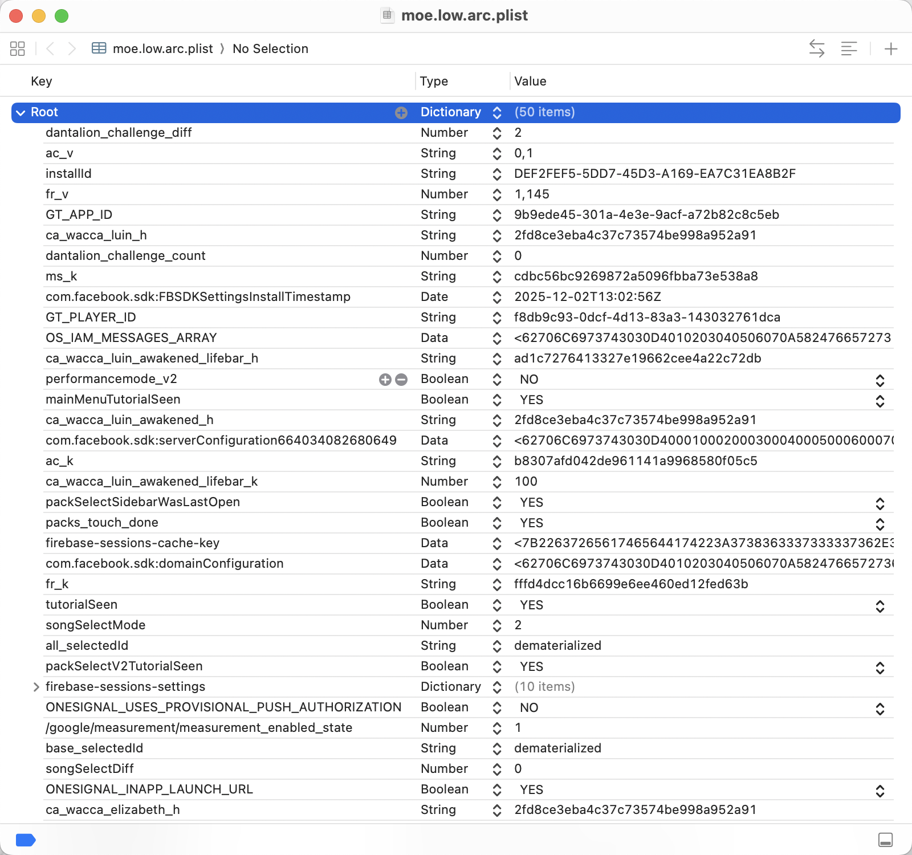
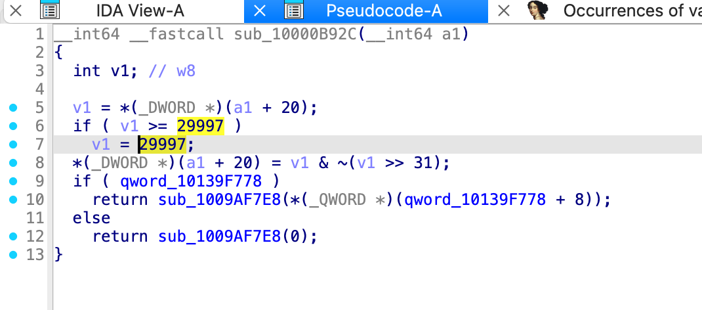

这篇文章依然是关于迫害某游戏的，所以还是先来点...
> 本文所写内容仅供学习交流，作者对于读者所做的任何行为概不负责，如果跟着本文所写内容操作，您需要对自己的行为导致的任何后果负责！

这次是关于残片。当然网上似乎已经有很多关于残片怎么改的。安卓或者 ios 都可以改，都是去修改一个配置文件就可以了，ios 上是 plist，直接拿 xcode 打开就能更改。

找到 fr_v 和 fr_k ，v 是 value，写想要的数值，k 是校验，是 "\<num\>ok\<num\>"的 md5 值，比如
```shell
> md5 -s "1145ok1145"
fffd4dcc16b6699e6ee460ed12fed63b
```


这样残片就改好了，安卓一个样，换个软件改就行。

但是这样似乎有点麻烦啊，我们想要个更速的，更持久化的无敌爆金币方法。然后找不到逆向二进制的入手点怎么办呢......

这时候打开 ida，然后想到残片是有上限的，一条亮杠是 9999，最多是 29997，于是打开 ida 查找立即数 29997，然后好消息只找到了两个！

其中一处是展示 ui 的，另外一处是限制 fragment 的最大值的，这就是想要的。

简单阅读一下，v1 就是残片数量，它位于 a1 这个指针的 20 偏移处，当超过 29997 的时候就保持为 29997，后面那边做了一个bit clear，但是没啥用就是了。那就好办了，
```asm
; __int64 __fastcall sub_10000B92C(__int64)
sub_10000B92C
LDR             W8, [X0,#0x14]
MOV             W9, #0x752D
CMP             W8, W9                ; compare w8 and w9
CSEL            W8, W8, W9, LT        ; if less than, w8 = w8, else w8 = w9
BIC             W1, W8, W8,ASR#31     ; i32 >> 31 = 0，useless bic
STR             W1, [X0,#0x14]        ; result store to *(X0+20)
ADRP            X8, #qword_10139F778@PAGE
NOP
LDR             X8, [X8,#qword_10139F778@PAGEOFF]
CBZ             X8, loc_10000B95C
```

简单阅读一下 asm，然后我们就知道可以怎么改了，只需要
```asm
; __int64 __fastcall sub_10000B92C(__int64)
sub_10000B92C
LDR             W8, [X0,#0x14]
MOV             W9, #0x752D
CMP             W8, W9                ; compare w8 and w9
; just let w8 equals 29997, which w9 already be now.
; CSEL            W8, W8, W9, LT      ; if less than, w8 = w8, else w8 = w9
MOV             W8, W9
```

当然是想怎么改怎么改，中间全部 nop 掉也可以，我比较懒，直接 hack 一条完事。这里我使用直接改二进制而不是 keypatch，因为我似乎因为更新了一下 python 版本把 ida 的 python 搞坏了（？

打开 compiler explorer，写一下想要的指令

注意这里是大端序的，我们需要的是小端序的，也就是
```
e8 03 09 2a
MOV  W8, W9
```
然后把这个写入本来 csel 的地方，然后不要忘了写入你的更改到源文件，接下来就可以了。打开游戏，随便操作一下任何一个会更改残片的操作，比如领一下新手奖励，或者买一首歌，或者任何会扣，会增残片的操作，然后你就可以看到你的残片突然变为 29997 了，也无需担心什么校验什么的，因为这是在正常计算流程中计算出的现在的残片是 29997。

<center>

</center>

就是这样，嗯......

---

似乎前人早已发现直接改配置的地方，但是当初想持久化爆改的时候没找着直接 hack 二进制的办法，还是我自己找到的这个地方（？可能是我检索信息能力太差）总之挺有意思的，写下来供后人可参考。
