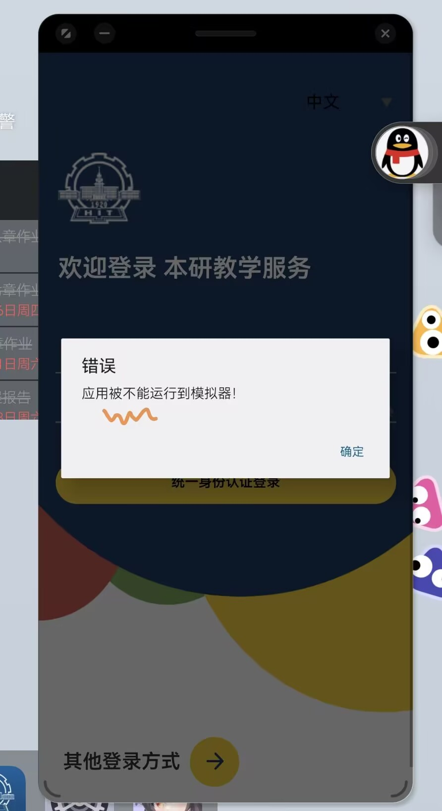
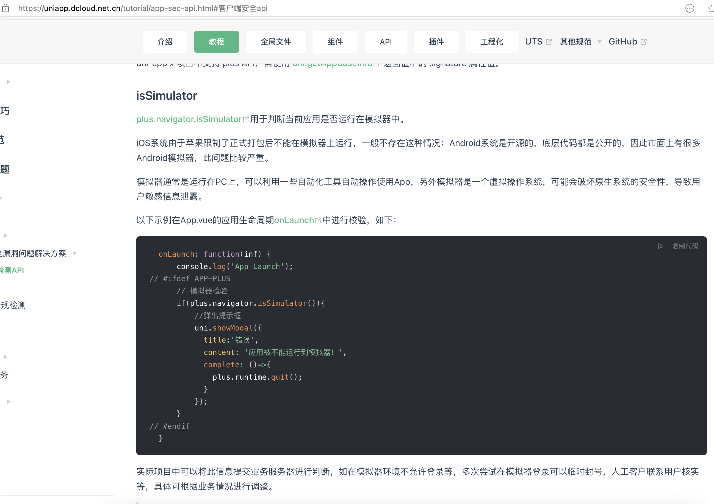

今天也是继续写很刑的话题。这次是笔者目前在读的某学校的教务 app。此 app 之前的版本毫无安全可言，没有任何校验等等.... 直到最近才勉强更新了一个版本。更新了一些小功能云云不必多谈，但是究其根本，居然换了一套 app 开发框架。简单一看，是国人开发的 `uniapp` 。

本来是没有任何想要逆向这个软件的，因为任何有意义一点的操作都可以直接去给 web 端抓包获得，但是一个朋友给我看到....

<center>

</center>

我当即就惊了，怎么大家都可以就他这个不可以。当然线下我肯定是狠狠嘲笑他被华为卡脖子了（华为平板），但是究其根本肯定是软件误检测了模拟器环境。因此尝试使用逆向改掉模拟器检测逻辑就显得意义重大。

于是我进行了一点点尝试。我在我的 mac 电脑上安装了一个app store里面的本研，但是发现——不能运行在 root/越狱 环境内。mac 上面的软件数据确实可以看得一清二楚，算越狱环境确实是情有可原。但是我们还得去破嘛。

这时候就发现，上面那图居然还有一个语法错误。
```
应用被不能运行到模拟器
```
什么叫做 **被不能** 运行到模拟器....... 这就是国产 api 吗....

但是这处也直接暴露了开发框架——我们可以在 [uniapp-客户端安全API](https://uniapp.dcloud.net.cn/tutorial/app-sec-api.html#%E5%AE%A2%E6%88%B7%E7%AB%AF%E5%AE%89%E5%85%A8api) 中找到


于是我们就可以直接确定这是 js 层的校验了。不需要去 so 里面patch。 ~~IDA 启动失败!~~ 然后我们在 ios 这里找找。进入
```sh
!w /Applications/本研教学服务.app/Wrapper/HBuilder.app                                           at 03:01:50 PM
> ls
AppIcon60x60@2x.png       Pandora                   control.xml               uni_uts_toast_error.png
Assets.car                PandoraApi.bundle         dcloud_logo@2x.png        uni_uts_toast_success.png
Base.lproj                PkgInfo                   dcloud_logo@3x.png        unincomponents.ttf
Frameworks                SC_Info                   en.lproj                  weex-polyfill.js
HBuilder                  _CodeSignature            uni-jsframework-vue3.js   weexUniJs.js
Info.plist                __uniappes6.js            uni-jsframework.js        zh-Hans.lproj
```
大概是一些打包信息。我们假设这条消息没有被混淆，那么
```
weexUniJs.js:var plusContext={};const DC_INTERVAL_ID="__dc__Interval_id__";var __dc__setInterval=function(e,t){return setIntervalWeex(DC_INTERVAL_ID,e,t)},__dc__clearInterval=function(e){clearIntervalWeex(DC_INTERVAL_ID,e)};plusContext.setInterval=__dc__setInterval,plusContext.clearInterval=__dc__clearInterval,plusContext.setTimeout=function(e,t){var n=arguments.length,i=Array(2<n?n-2:0);for(idx=2;idx<n;idx++)i[idx-2]=arguments[idx];var o=__dc__setInterval(function(){__dc__clearInterval(o),e.apply(void 0,i)},t=t||1);return o},plusContext.clearTimeout=__dc__clearInterval,plusContext.getLocationHerf=function(e){return e.weex.config.bundleUrl};var PlusObject=function(plusContext,param){plusContext.__param__=param;var dc_plusobjects={},dc_plusMouldes={};function PlusObject(e,t){for(var n in this.weex=t,this.weex_instance_id=e,this.__HtMl_Id__,this.__io__dc_vue_call_exec_sync="undefined"!=typeof global&&global.__io__dc_vue_call_exec_sync,this.__io__dc_vue_call_exec="undefined"!=typeof global&&global.__io__dc_vue_call_exec,this.weexBridge=t.requireModule("plus"),this.globalEvent=t.requireModule("globalEvent"),dc_plusMouldes){var i;this[n]||(i=dc_plusMouldes[n](plusContext,this,this.require,param[n]))&&(this[n]=i)}}return PlusObject.prototype.updateConfigInfo=function(){var e=this.weexBridge.getConfigInfo();if(e)for(var t in"string"==typeof e&&(e=JSON.parse(e)),this.__WebVieW_Id__=e.__WebVieW_Id__,this.__HtMl_Id__=e.__HtMl_Id__,e){var n=this[t];if("object"==typeof n&&e[t])if(n.updateInfo)n.updateInfo(e[t]);else{var i,o=e[t];for(i in o)n[i]=n[i]||o[i]}}},PlusObject.prototype.require=function(e){var t;return this[e]||(t=dc_plusMouldes[e](plusContext,this,this.require,param[e]))&&(this[e]=t),this[e]},PlusObject.prototype.importMoudle=function(name){if(this[name])return this[name];var script=t............
```

一查发现一个巨大的 js 居然是一行... 没眼看，但是看到这个最让人怀疑的`weexUniJs.js`。进入查看，格式化一下，发现
```js
isSimulator: function () {
          return bridge.execSync(_PLUSNAME, 'isSimulator', [])
        },
```
以及上面有一个 isroot。我们直接将两个函数的返回值改为 false之后， 在mac上就可以直接运行了。

接下来就是 android 的部分了。

首先要先确定有没有签名校验。要是有签名校验可就麻烦一些了，只能先破掉这个再谈其他。结果测试一下，不但没有签名校验，也没有反debug校验..... 安全了但没有完全安全，于是用 `apktool` 反编译之后，查找到`unknown/io/dcloud/weeUniJs.js`，
```js
isRoot: function () {
    return (
    plus.tools.ANDROID != plus.tools.platform &&
    bridge.execSync(_PLUSNAME, 'isRoot', [])
    )
},
isSimulator: function () {
    return bridge.execSync(_PLUSNAME, 'isSimulator', [])
},
```
将两个函数返回值改为 false，重新打包就可以了。

---

小插曲
---
最开始根本没发现，尝试了反编译 smali，手动patch smali.... 完全不熟悉js层和java层的内容。浪费了好多时间hhh
