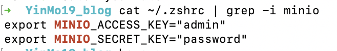

说起来其实早些时候加入了 [开源技术协会](osa.moe)，所以对 Linux 也算有了一些了解。后来在暑假拥有了一台 Mac，也算是类 Unix 系统，所以用起来在命令行上熟悉的很快，而且 Mac 的访达（相当于文件资源管理器）也非常方便，所以这里就写一篇简单介绍我的 Mac 的工作流。

# 一些有用的软件

拿到的第一件事其实是下载了 `MacTeX` ，也就是 `LaTeX` 的 Mac 版本。发觉 Mac 安装软件竟然如此简单，dmg 文件类似于 iso 镜像文件，会先挂载，然后我们在安装完成之后可以 unmount。但是有一些 dmg 文件已经做好了 ui 界面，只需要手动的同意同意就可以了。所以安装上没遇到任何困难。安装完成之后删除 dmg 文件，然后在命令行测试
```
➜  YinMo19_blog tex -v
TeX 3.141592653 (TeX Live 2024)
kpathsea version 6.4.0
Copyright 2024 D.E. Knuth.
There is NO warranty.  Redistribution of this software is
covered by the terms of both the TeX copyright and
the Lesser GNU General Public License.
For more information about these matters, see the file
named COPYING and the TeX source.
Primary author of TeX: D.E. Knuth.
➜  YinMo19_blog 
```
`➜  YinMo19_blog ` 是 Mac 的 `zsh` 命令行的命令提示符，表示当前目录为 `YinMo19_blog`。

下一件事是安装 `python`，于是还是到官网下载 dmg 文件，然后点点点就可以了。稍微有一些难度的是接下来的包管理器。熟悉 Linux 就知道 Linux 安装软件依赖都是使用包管理工具来进行安装，例如 `apt,npm,yarn,pacman` 等等。Mac 使用的是 `homebrew` 。网上有很多教程，官网的方法可能有些慢，所以我选择清华镜像源。按照清华镜像源的帮助文档一步步跟着配就可以了。注意，`homebrew` 本体的下载也可以用镜像下载，清华源提供了方式，可以认真看一下。在下载完成之后配置镜像源可以在命令行中使用 `vim` 编辑 `~/.zshrc` 或者 `~/.zprofile`。

这里关于命令行的 `zsh/bash` 是什么就不介绍了，可以自行查阅。`zsh` 可以配置 `oh-my-zsh` 来美化，具体内容可以在网络上查阅。

# 了解 Mac

Mac 的访达非常好用。访达本身看上去是一个个文件夹，但是我们可以切换显示的方式。例如我很喜欢分栏

例如上面的图片就是我此时写 blog 的目录。另外还有例如 gallary 的显示方式，用于看图非常合适。而配合命令行来对文件和各种文件进行管理。命令行可以做到几乎所有事情，例如我们想要在这个博客下面查找一个文件，我们可以先使用 `find` 命令来查找。他的使用和 `tldr` 文档在上一篇 blog 中已经介绍过了，所以我们这里就不再演示。

更有意思的是，例如我们可以配合管道符和 `grep` 来查找文件和各种内容。例如 `cat` 可以把 file 的内容输出到命令行，然后我们将内容实用管道符传给 `grep` ，然后就可以查找到相关信息。 我最近使用 `minio` 来作为一个简单的服务器的存储方案，它需要在环境变量中获取账号密码的值。我们想要查看我们现在的账号密码的值只需要

这样我们就可以轻松的看到之前设置的内容了。相似的，我们在查看ip地址的时候输入
```
➜  ~ ifconfig
lo0: flags=8049<UP,LOOPBACK,RUNNING,MULTICAST> mtu 16384
	options=1203<RXCSUM,TXCSUM,TXSTATUS,SW_TIMESTAMP>
	inet 127.0.0.1 netmask 0xff000000
	inet6 ::1 prefixlen 128 
	inet6 fe80::1%lo0 prefixlen 64 scopeid 0x1 
	nd6 options=201<PERFORMNUD,DAD>
gif0: flags=8010<POINTOPOINT,MULTICAST> mtu 1280
stf0: flags=0<> mtu 1280
anpi1: flags=8863<UP,BROADCAST,SMART,RUNNING,SIMPLEX,MULTICAST> mtu 1500
	options=400<CHANNEL_IO>
	ether d2:5e:23:52:fb:4e
	media: none
	status: inactive
...
```
等等非常多的内容，现在只需要使用

```
➜  ~ ifconfig | rg 10 
gif0: flags=8010<POINTOPOINT,MULTICAST> mtu 1280
                maxage 0 holdcnt 0 proto stp maxaddr 100 timeout 1200
        inet 10.250.155.82 netmask 0xffff0000 broadcast 10.250.255.255
        inet6 fe80::106b:e1ff:fedc:c0b7%awdl0 prefixlen 64 scopeid 0xd 
        inet6 fe80::106b:e1ff:fedc:c0b7%llw0 prefixlen 64 scopeid 0xe 
        inet6 fe80::7aa:1193:a74b:77ec%utun1 prefixlen 64 scopeid 0x10 
utun2: flags=8051<UP,POINTOPOINT,RUNNING,MULTICAST> mtu 1000
        inet 100.99.118.11 --> 100.99.118.11 netmask 0xffffffff
➜  ~ 
```

`rg` 是 `ripgrep` 的缩写，是一个 `grep` 的可替代工具。

# 个人网盘
因为现在有很多设备，因此我需要在几台机子上传输数据。因此现在我在 mac 上面部署了一个 `alist` 服务，可以快速访问。

部署的细节这里就不描述了。我购买了一个域名 `yinmo19.top`，分别用 `file.yinmo19.top` 和 `cloud.yinmo19.top` 绑定了我的 ipv4 和 ipv6 地址。但是默认端口是 5244，因此使用 `nginx` 将 5244 重定向到 80。这样我们就不需要使用端口号来访问。（80端口是默认的http端口） 


---
可以介绍的，暂时咕咕不想写的
---
`mediamtx`: 用于将 rtsp 流转成 http 流传输，方便在 `obs` 中直接通过网络直播的 CLI。

`git-delta`: 看 `diff` 小工具。


太多了，so..... TOBE CONTINUED~